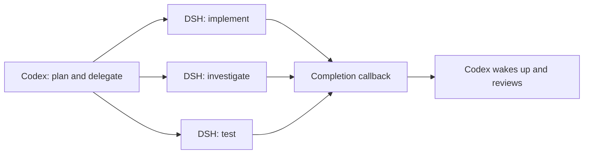

<h1 align="center">DSH Subagent MCP</h1>
<p align="center"><strong>Let Codex lead. Put DeepSeek to work.</strong></p>

<p align="center">
  <a href="https://www.npmjs.com/package/dsh-subagent-mcp"></a>
  <a href="https://github.com/deepseek-ai/deepseek-harness"></a>
  <a href="https://modelcontextprotocol.io/"></a>
  <a href="skills/dsh-subagent/SKILL.md"></a>
  <a href="package.json"></a>
  <a href="LICENSE"></a>
  <a href="https://github.com/dqtz5vpvj9-create/dsh-subagent-mcp/stargazers"></a>
</p>

<p align="center">English · <a href="README.zh-CN.md">中文</a> · <a href="#get-started">Quick start</a> · <a href="docs/usage.md">Usage guide</a></p>

**Give Codex a team of persistent DeepSeek agents.** Delegate implementation, investigation, or testing in parallel. Codex stays available for other work—or stops reasoning until a result arrives, then wakes up to review it.

DSH runs the full DeepSeek Harness with its own tools and conversation. Codex handles planning, delegation, and acceptance; each DSH agent handles a complete task.

## Delegate. Let it run. Get the result.



| What matters | What you get |
| :--- | :--- |
| **Automatic return** | Each finished task returns native Codex tool output. An idle parent wakes up; an active parent receives the result in its current turn. |
| **Quiet while waiting** | A detached listener waits outside the model. No repeated model-driven status checks or “is it done yet?” turns. |
| **Parallel work** | Independent agents finish and report separately. Give each a clear deliverable and its own file ownership. |
| **Context that carries forward** | Continue the same DSH conversation for fixes and follow-ups. New agents use the standard preset with automatic compaction and tool-result pruning. |
| **You stay in control** | Choose read-only or workspace-write permissions, inspect progress, interrupt work, and redirect the same agent. |
| **Reviewable history** | DSH Web groups delegated runs under one parent per workspace. The MCP bridge provides their live status and tool activity. |

## Get started

You need **Linux with systemd, Node.js 24+, Python 3, Codex CLI, and a configured DSH installation**. Native callbacks need a Codex App Server supporting `turn/start.toolOutput`; the [live validation](docs/codex-callback-validation.md) used CLI 0.157.1 and App Server 0.157.0.

```sh
npx -y dsh-subagent-mcp@latest setup --skill
```

Setup installs a persistent local service, registers the MCP server, and links the skill. Its runtime stays outside the disposable npx cache. If your DeepSeek key exists only in the current shell, add `--capture-key`. See [setup and upgrades](docs/setup.md).

Open a new Codex session and ask:

```text
Use $dsh-subagent to implement the agreed plan in parallel.
Give each agent a complete deliverable, separate file ownership, and relevant tests.
Register completion callbacks, then review and integrate each result when it arrives.
```

For a smaller first task:

```text
Use $dsh-subagent to investigate why cancelled requests leave workers running.
Keep it read-only and return the root cause with code references.
```

You can later ask “What has it found?”, continue with “Have that same agent fix it and run the tests”, or stop it when the plan changes.

## Spend model calls on work

The bundled skill registers one host-side listener after each start or follow-up. The listener waits for DSH, saves the full result, and returns the answer as a native `dsh_completion` tool result. Codex can do independent work or end its turn until the callback arrives.

In one live test, an idle parent made **zero model requests and used zero input/output tokens over 55.834 seconds**, then resumed automatically from the DSH result. Dispatch and review still use Codex tokens; DSH has its own provider usage. This measures idle waiting, not an overall cost-saving percentage. See the [test and evidence boundary](docs/codex-callback-validation.md).

Errors and context exhaustion also return to the parent. A tool failure that the child is still fixing does not end its task. Explicitly interrupted or closed agents do not trigger a continuation callback.

## See the work, keep the conversation

Each workspace has a **Claude Code / Codex 子代理** entry in DSH Web. Open its subagent catalog to inspect individual conversations and traces without filling the sidebar with every delegated run.

The browser reads persisted history, so it can lag and its running indicators are not authoritative for bridge-owned agents. Ask Codex for live status or tool activity through MCP. Follow-ups and cancellation also go through the bridge.

Already working in an ordinary DSH Web session? Attach it with `dsh_attach` and continue that same conversation. Details are in the [usage guide](docs/usage.md).

## Explore the bridge

| Guide | Contents |
| :--- | :--- |
| [Setup](docs/setup.md) | Credentials, persistent installation, upgrades, and older-session migration |
| [Usage](docs/usage.md) | Tools, callbacks, follow-ups, progress, external sessions, and context budgets |
| [Architecture](docs/architecture.md) | Runtime ownership, permissions, and lifecycle |
| [Operations](docs/operations.md) | Service management, callback recovery, and browser history |
| [Callback validation](docs/codex-callback-validation.md) | Active/idle parent delivery and measured idle usage |
| [Changelog](CHANGELOG.md) | Release changes and compatibility notes |

The execution tools work with other MCP clients, including Claude Code. Automatic parent wakeup described here uses the Codex-specific callback; other clients use their supported notification or waiting mechanism. DSH appears as MCP activity in Codex today.

If this improves your workflow, [star the project](https://github.com/dqtz5vpvj9-create/dsh-subagent-mcp/stargazers) or share your experience in [Issues](https://github.com/dqtz5vpvj9-create/dsh-subagent-mcp/issues).

## Built on

[DeepSeek Harness](https://github.com/deepseek-ai/deepseek-harness) and the [MCP SDK](https://github.com/modelcontextprotocol/typescript-sdk). Thanks to [dsh-mcp](https://github.com/Mr-potato-123/dsh-mcp) and [dsh-cursor-codex](https://github.com/jeremy9682/dsh-cursor-codex) for exploring DSH delegation, and [DSH-Code](https://github.com/unlinearity/dsh-code) for the terminal UI that sparked this project.

[MIT](LICENSE). Independent community project.
