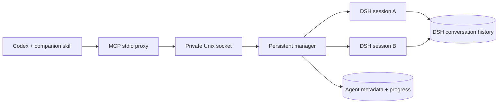

# DSH Subagent MCP

**Delegate to DeepSeek Harness. Keep the conversation.**

[中文](README.zh-CN.md) · [Codex skill](skills/dsh-subagent/SKILL.md) · [Validation](docs/validation.md)

Give Codex a DSH agent you can follow up with, inspect, and interrupt—even after reconnecting your client.

> “Ask DSH to trace the parser bug.”
>
> “What is it doing now?”
>
> “Stop that investigation. Ask the same agent to check the tokenizer instead.”

DSH Subagent MCP makes this a continuous workflow: a stable agent ID, a persistent conversation, and explicit control over execution.

## Why we built it

Delegation rarely ends with the first answer. A finding raises another question. A task takes a wrong turn. You close your editor and return later.

A one-shot worker can return a useful result, but the parent then needs a way to continue that worker's conversation, see what it is doing, and stop its current work. Those controls belong alongside delegation.

This project gives **Codex responsibility for coordination** and **DeepSeek Harness responsibility for execution**. Codex sends a bounded task; DSH uses its own model loop, tools, sandbox, and session history. Follow-up questions return to the same DSH session. The main conversation receives the progress and results it needs without importing the entire worker transcript.

## What you get

- **Persistent conversations.** Follow up using the same agent ID. Resume history after a service restart.
- **Progress you can inspect.** Read visible output, tool calls, lifecycle events, and final results. Use cursors to fetch only new events.
- **Cancellation with acknowledgement.** Interrupt active work and wait until DSH reaches idle before redirecting it.
- **Client-independent execution.** A local daemon keeps tasks alive when an MCP client disconnects.
- **Explicit permissions.** Select DSH's `read-only`, `workspace-write`, or explicitly authorized `danger-full-access` mode.
- **A companion Codex skill.** Teaches the parent when to start, wait, follow up, interrupt, and retain a session.

This connects the **DSH harness**, not just a DeepSeek API model. In Codex it appears as MCP tool activity, rather than a native `/agent` thread.

## Quick start

Currently supported: **Linux with systemd user services**, Node.js **24+**, Codex CLI, and the Node.js distribution of DSH. The tested DSH version is **0.1.5-rc.1**. Existing working DSH installations can be reused.

```sh
npm install -g @deepseek-ai/dsh@0.1.5-rc.1
git clone https://github.com/dqtz5vpvj9-create/dsh-subagent-mcp.git
cd dsh-subagent-mcp
npm ci --ignore-scripts
npm run setup -- --skill
```

DSH needs a configured provider credential. If you already use DSH's credential store, the service can reuse it. If your key exists only in the current shell as `DEEPSEEK_API_KEY`, use:

```sh
npm run setup -- --skill --capture-key
```

`--capture-key` saves the current provider environment in a mode-0600 service file without printing it. It preserves an existing file. Keys never belong in task prompts or Codex's MCP configuration.

The installer creates a dedicated `codex-subagent` DSH profile, installs and starts a systemd user service, registers `dsh_subagent` with Codex, and optionally links the bundled skill into `${CODEX_HOME:-~/.codex}/skills`. It does not modify installed DSH source. Re-running setup restarts this service, so finish or interrupt active bridge tasks before upgrading.

Open a new Codex session, check `/mcp`, and ask:

```text
Use $dsh-subagent to investigate this repository in read-only mode.
Find where request cancellation reaches the worker process.
Keep the DSH agent ID so we can ask follow-up questions.
```

Then:

```text
Show that agent's progress and latest tool activity.
```

```text
Interrupt it. Once it has stopped, ask the same agent to inspect timeout handling.
```

## Tool contract

| Tool | What it does |
|---|---|
| `dsh_start` | Starts asynchronously and returns a stable `id`; requires an absolute `cwd`. |
| `dsh_status` | Returns state, visible partial text, answer, and `finish_reason`. |
| `dsh_events` | Returns chronological progress after a cursor. |
| `dsh_list` | Finds agents from current and previous client sessions. |
| `dsh_wait` | Waits for up to 25 seconds and returns current state. |
| `dsh_followup` | Continues an idle agent, restoring its persisted DSH conversation if necessary. |
| `dsh_interrupt` | Cancels active and queued input, waits for idle, and flushes history. |
| `dsh_close` | Releases the runtime and closes that bridge agent while retaining history. |

The 25-second wait limit applies only to one observation call, not to the DSH task. When it expires, work keeps running. There is no task deadline implied by this window; the parent can do other work and check progress when needed.

Pass the returned `id` as `agent_id` in later calls. A busy agent rejects follow-ups: interrupt it first when changing direction. Keep the agent open while further questions are expected; closing it disables follow-ups through the bridge.

Default configuration: `deepseek-official` / `deepseek-v4-flash`, reasoning effort `max`, permission `workspace-write`. These can be selected at creation; provider routes must be available in the DSH composition.

## How it works



Each agent owns a DSH process and working directory. The bridge uses DSH's SDK JSON-RPC interface, plus a separate plugin exposing cancellation, checkpointing, and persisted-session resume. The plugin uses DSH's existing agent registry and cancellation mechanism.

Disconnecting a client leaves work running. Restarting the daemon stops its processes and marks unfinished work interrupted. Execution resumes only after an explicit follow-up; the bridge does not replay an unfinished task automatically.

## Operational boundaries

- A child does not inherit the Codex transcript. Include the relevant context, permitted actions, and acceptance criteria in its task.
- DSH permissions are independent of Codex permissions. Do not grant broader access than the parent task authorizes. Approval escalation has no human answerer in this bridge and fails closed.
- Interrupting does not undo files already changed. Check results against actual artifacts.
- Progress is queried through tools; it is not automatically pushed into the parent conversation. Large tool events are marked truncated.
- The daemon is local to one Unix account. Clients under that account share its agent inventory. It is not a multi-user or network service.
- DSH is evolving. Re-run live tests after upgrading it; this version extends the exported SDK server class and uses the agent registry.

## Manage and validate

```sh
systemctl --user status dsh-subagent-mcp.service
codex mcp get dsh_subagent
npm test
```

Live tests make real model calls and use temporary workspaces:

```sh
node test/live.mjs
node test/mcp-live.mjs
```

Set `TMPDIR` to choose the temporary-file location. Raw validation reports are generated locally and excluded from Git. See [validation coverage and limits](docs/validation.md).

State lives under `~/.local/state/dsh-subagent-mcp`; full conversation history belongs to DSH's configured home. The socket is mode 0600 inside a mode-0700 directory. Provider environment, when captured, lives at `~/.config/dsh-subagent-mcp/environment`. Refresh that private file when rotating credentials, then restart the service.

Advanced installation overrides: `DSH_CLI` (the JavaScript CLI entrypoint), `DSH_HOME`, and `DSH_SUBAGENT_STATE`.

To disconnect without deleting source or history:

```sh
codex mcp remove dsh_subagent
systemctl --user disable --now dsh-subagent-mcp.service
```

The optional skill remains a link to `skills/dsh-subagent`; remove that link separately if you no longer need it.

## Credits and license

Built on [DeepSeek Harness](https://github.com/deepseek-ai/deepseek-harness) and the [Model Context Protocol SDK](https://github.com/modelcontextprotocol/typescript-sdk).

[Mr-potato-123/dsh-mcp](https://github.com/Mr-potato-123/dsh-mcp) and [jeremy9682/dsh-cursor-codex](https://github.com/jeremy9682/dsh-cursor-codex) informed our exploration of DSH delegation. This implementation focuses on persistent conversations and lifecycle control. [DSH-Code](https://github.com/unlinearity/dsh-code) is a separate terminal UI for the harness.

MIT licensed. Independent community project; not affiliated with OpenAI or DeepSeek.
