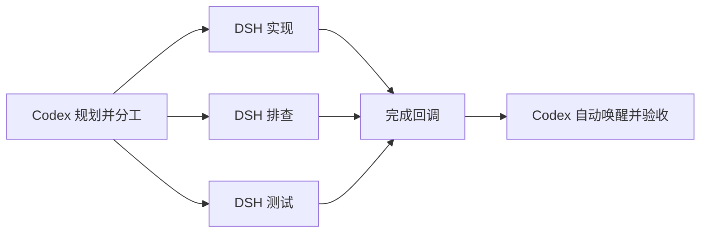

<h1 align="center">DSH Subagent MCP</h1>
<p align="center"><strong>Codex 把握全局，DeepSeek 并发执行。</strong></p>

<p align="center">
  <a href="https://www.npmjs.com/package/dsh-subagent-mcp"></a>
  <a href="https://github.com/deepseek-ai/deepseek-harness"></a>
  <a href="https://modelcontextprotocol.io/"></a>
  <a href="skills/dsh-subagent/SKILL.md"></a>
  <a href="package.json"></a>
  <a href="LICENSE"></a>
  <a href="https://github.com/dqtz5vpvj9-create/dsh-subagent-mcp/stargazers"></a>
</p>

<p align="center">中文 · <a href="README.md">English</a> · <a href="#开始使用">开始使用</a> · <a href="docs/usage.md">使用指南</a></p>

**给 Codex 配一组能持续协作的 DeepSeek 子代理。** 实现、排查、测试可以并行展开。Codex 可以继续处理其他工作，也可以停止推理，等结果送达后自动醒来验收。

每个子代理运行完整的 DeepSeek Harness，拥有自己的工具和会话。Codex 负责规划、委派和验收，DSH 负责把领到的任务做完。

## 交付任务，后台执行，完成自动回传



| 你关心的事 | 实际体验 |
| :--- | :--- |
| **做完会回来** | 每个任务完成后，以 Codex 原生工具结果回传。父代理空闲时自动唤醒，忙碌时在当前轮次接收。 |
| **等待不空转** | 后台监听器在模型之外等待，无需让模型反复查询状态。 |
| **独立并发** | 多个代理各领一份完整任务，分别完成、分别回传；用清晰的文件归属避免相互覆盖。 |
| **上下文接得上** | 同一个 DSH 会话可以继续追问、修复和验证。新代理默认使用标准模式，包含自动上下文压缩和工具结果裁剪。 |
| **随时掌握方向** | 明确选择只读或工作区写入权限，查看进度，需要时中断并调整任务。 |
| **过程可以审查** | DSH 网页按工作区归组展示子代理历史，MCP 提供实时状态和工具活动。 |

## 开始使用

需要 **Linux + systemd、Node.js 24+、Python 3、Codex CLI，以及已配置模型凭据的 DSH**。原生回调需要 Codex App Server 支持 `turn/start.toolOutput`；[实测环境](docs/codex-callback-validation.md)为 CLI 0.157.1、App Server 0.157.0。

```sh
npx -y dsh-subagent-mcp@latest setup --skill
```

安装器会部署持久运行的本地服务、注册 MCP 并链接 skill，运行文件不依赖 npx 临时缓存。如果 DeepSeek key 只在当前 shell 中，再加上 `--capture-key`。详见[安装与升级](docs/setup.md)。

新开 Codex 会话，直接安排：

```text
用 $dsh-subagent 并发实现已经确认的方案。
每个代理领取完整任务，明确文件归属，并完成相关测试。
注册完成回调，结果送达后逐个验收和集成。
```

也可以先试一个小任务：

```text
用 $dsh-subagent 查一下，为什么请求取消后 worker 还在运行。
保持只读，给出根因和对应代码位置。
```

之后随时问“查到哪了”，接着安排“让刚才那个代理修好并跑测试”，或者在方向变化时叫停。

## 把模型调用用在工作上

配套 skill 在每次启动或追问后注册一个后台监听器。监听器等待 DSH 结束，保存完整结果，再将答复作为原生 `dsh_completion` 工具结果送回。Codex 可以继续处理独立工作，也可以结束当前轮次，等待回调。

一次真实测试中，父 Codex 空闲 **55.834 秒，新增模型请求为 0，输入和输出 token 均为 0**，随后由 DSH 结果自动唤醒。委派和验收仍消耗 Codex token，DSH 也有自己的模型用量。这项测量针对等待阶段，不能换算成整个任务的节省百分比。详见[测试记录](docs/codex-callback-validation.md)。

任务错误退出或上下文耗尽也会回传。子代理正在处理的单次工具失败不会提前结束整个任务；明确中断或关闭的代理不会触发继续执行的回调。

## 过程看得见，后续接得上

DSH 网页中，每个工作区有一条 **Claude Code / Codex 子代理** 会话。打开其中的子代理列表，即可查看各个任务的对话和轨迹，自己的会话列表不会被委派任务淹没。

网页读取的是持久化历史，可能落后于实际执行，其运行标识也不能代表 bridge 代理的实时状态。需要实时进度或工具活动时，直接让 Codex 通过 MCP 查询；追问和中断也由 bridge 处理。

已经在普通 DSH Web 会话中开始了工作？可以用 `dsh_attach` 接入并继续原来的会话，详见[使用指南](docs/usage.md)。

## 进一步了解

| 文档 | 内容 |
| :--- | :--- |
| [安装](docs/setup.md) | 凭据、持久安装、升级和旧会话迁移 |
| [使用](docs/usage.md) | 工具、回调、追问、进度、外部会话和上下文预算 |
| [架构](docs/architecture.md) | 进程归属、权限和生命周期 |
| [运维](docs/operations.md) | 服务管理、回调恢复和网页历史 |
| [回调验证](docs/codex-callback-validation.md) | 忙碌与空闲父代理的回传、等待期间的实际用量 |
| [更新日志](CHANGELOG.md) | 版本变化和兼容性说明 |

执行工具也可用于 Claude Code 等其他 MCP 客户端。这里的自动唤醒使用 Codex 专用回调；其他客户端采用各自支持的通知或等待方式。目前 DSH 在 Codex 中显示为 MCP 活动。

如果它让你的工作更顺手，欢迎[点个 Star](https://github.com/dqtz5vpvj9-create/dsh-subagent-mcp/stargazers)，也欢迎在 [Issues](https://github.com/dqtz5vpvj9-create/dsh-subagent-mcp/issues) 分享用法和遇到的问题。

## 致谢

基于 [DeepSeek Harness](https://github.com/deepseek-ai/deepseek-harness) 和 [MCP SDK](https://github.com/modelcontextprotocol/typescript-sdk) 构建。感谢 [dsh-mcp](https://github.com/Mr-potato-123/dsh-mcp) 与 [dsh-cursor-codex](https://github.com/jeremy9682/dsh-cursor-codex) 对 DSH 委派的探索，以及启发本项目的终端界面 [DSH-Code](https://github.com/unlinearity/dsh-code)。

[MIT 许可](LICENSE)，独立社区项目。
