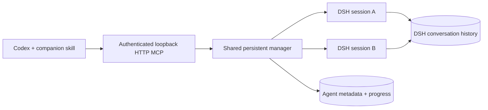

# Runtime and permissions

Each active agent owns a DSH process and working directory. Settled agents checkpoint their history and release the process; follow-ups restore the same session. The bridge uses DSH's SDK JSON-RPC interface, plus a separate plugin exposing cancellation, checkpointing, and persisted-session resume.

Codex connects directly to one authenticated HTTP MCP endpoint on loopback. Idle
chats own no Node proxy or MCP server object. Each request releases its server
and listeners when its response finishes or the client disconnects. An unbounded
wait retains only that pending request; cancellation detaches its observer without
stopping the DSH task. Endpoint credentials and the port survive service restarts.

Local IPC is a private Unix socket on Linux and macOS, or authenticated loopback
TCP on Windows. It serves CLI administration and legacy stdio clients. The stdio
entrypoint loads only forwarding code and exits when its input or connection closes.
Native per-user services keep the manager available; a detached
background process is used when login services are unavailable. Installation,
configuration and task state follow each platform's user-directory conventions.

Disconnecting a client leaves work running. Restarting the daemon stops its processes and marks unfinished work interrupted. Execution resumes only after an explicit follow-up; the bridge does not replay an unfinished task automatically.

## Operational boundaries

- A child does not inherit the Codex transcript. Include the relevant context, permitted actions, and acceptance criteria in its task.
- The bridge applies the requested permission preset after DSH creates the session, then refuses to run if DSH reports a different effective preset. Applying it earlier let a user default such as `danger-full-access` replace `workspace-write`.
- DSH's platform permission backend enforces `workspace-write` and `read-only`. On Linux, `workspace-write` confines file writes to `cwd` and gives the shell a private temporary directory; network access remains available.
- DSH permissions are independent of Codex permissions. Do not grant broader access than the parent task authorizes. Approval escalation has no human answerer in this bridge and fails closed.
- Interrupting does not undo files already changed. Check results against actual artifacts.
- Completion events release pending `dsh_wait` calls. In Codex, the skill's host-side listener saves the result and sends it through App Server `turn/start.toolOutput`, which can wake an idle parent. The callback carries the answer inline and preserves a full result artifact. Other clients use a pending wait when no native callback is available. Progress is queried through tools; large events are marked truncated.
- The daemon belongs to one operating-system user. Clients under that account share its agent inventory; its IPC endpoint is not exposed to the network.
- DSH is evolving. Re-run live tests after upgrading it; this version extends the exported SDK server class and uses the agent registry.
