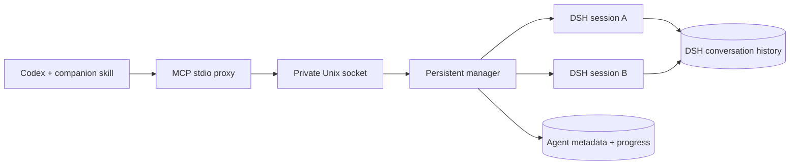

# Runtime and permissions

Each agent owns a DSH process and working directory. The bridge uses DSH's SDK JSON-RPC interface, plus a separate plugin exposing cancellation, checkpointing, and persisted-session resume. The plugin uses DSH's existing agent registry and cancellation mechanism.

Disconnecting a client leaves work running. Restarting the daemon stops its processes and marks unfinished work interrupted. Execution resumes only after an explicit follow-up; the bridge does not replay an unfinished task automatically.

## Operational boundaries

- A child does not inherit the Codex transcript. Include the relevant context, permitted actions, and acceptance criteria in its task.
- The bridge applies the requested permission preset after DSH creates the session, then refuses to run if DSH reports a different effective preset. Applying it earlier let a user default such as `danger-full-access` replace `workspace-write`.
- `workspace-write` confines file writes to `cwd` and gives the shell a private `/tmp`; network access remains available.
- DSH permissions are independent of Codex permissions. Do not grant broader access than the parent task authorizes. Approval escalation has no human answerer in this bridge and fails closed.
- Interrupting does not undo files already changed. Check results against actual artifacts.
- Completion events release pending `dsh_wait` calls. The skill keeps the parent turn active and requires it to process results. This does not wake a parent turn that has ended. Progress is queried through tools; large events are marked truncated.
- The daemon is local to one Unix account. Clients under that account share its agent inventory. It is not a multi-user or network service.
- DSH is evolving. Re-run live tests after upgrading it; this version extends the exported SDK server class and uses the agent registry.

